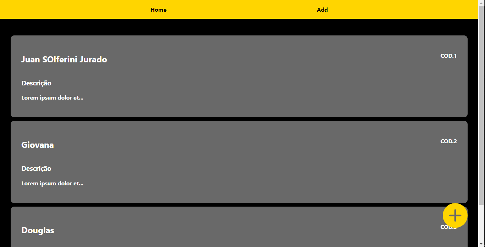
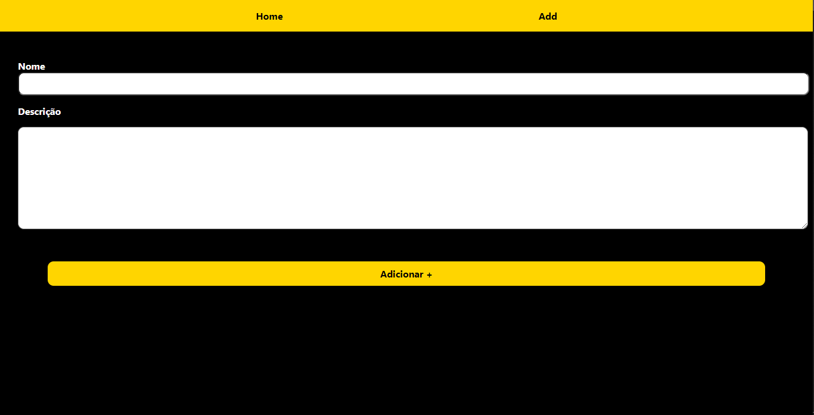

# Simple list model in ReactJS

It's a simple list project for study basic methods and hooks in react.

## Home:

## Add in List:

## Juan Solferini Jurado

LinkedIn: https://www.linkedin.com/in/juan-jurado-b87036141/